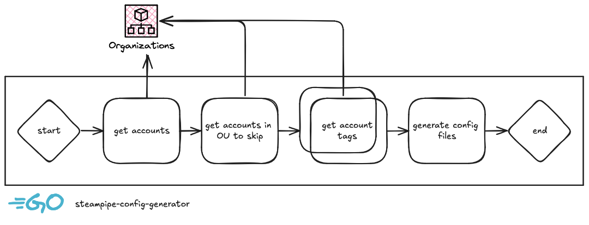

# Steampipe Config Generator

Manage your [Steampipe](https://steampipe.io/) AWS config files at scale!


## What is this?

*steampipe-config-generator* is tool that generates configuration files for [steampipe-aws-plugin](https://hub.steampipe.io/plugins/turbot/aws). These files are used by Steampipe AWS plugin to connect to your AWS Accounts and fetch the desired data.

We have created this tool to facilitate the creation and management of these files in organizations with multiple accounts.  
If you want more details about this, check our blog post: [Automate your Steampipe AWS configuration with AWS Organizations](https://unicrons.cloud/en/2024/10/18/automate-your-steampipe-aws-configuration-with-aws-organizations/)




## Features

- Automate generation of `.aws/credentials` and `.steampipe/config/aws.spc` for your AWS Organization.
- Create Steampipe connection *[aggregators](https://steampipe.io/docs/managing/connections#using-aggregators)* using your AWS Organization Accounts tags.
- Skip AWS Accounts based on their organizational units.
- Assume an IAM role to fech AWS Organizations information.


## Requirements

- Valid AWS credentials with the following IAM actions:
  ```json
  "organizations:ListAccounts",
  "organizations:ListParents",
  "organizations:ListTagsForResource"
  ```
- An AWS IAM Role deployed in all your AWS accounts with your required permissions for Steampipe.


## How to use it

```bash
./steampipe_config_generator -role my-org-role-name
```

If you are executing the tool inside an EC2 instance use `-credential Ec2InstanceMetadata` flag.
If you are executing the tool inside an ECS container use `-credential EcsContainer` flag.


### Create Aggregators

The [aws_connections.tmpl](/code/templates/aws_connections.tmpl) template is used to generate the AWS connections files where you can add the needed *aggregators*.

To create an *aggregators* based on your AWS Account names. E.g: The following template will create an aggregator with all your AWS Accounts whose name begins with `Sandbox`:
```go
connection "aws_sandbox" {
  plugin      = "aws"
  type        = "aggregator"
  connections = ["aws_sandbox_*"]
}
```

> [!NOTE]
> All AWS Account names are normalized to lowercase. Spaces and hyphens are replaced by `_`.

To create an *aggregators* based on your AWS Accounts tags.
E.g: The following template will create an aggregator with all your AWS Accounts that contains the tag `team:engineering`:
```go
{{ $teamEng := index .Tags "team,engineering" }}
connection "aws_engineering_team" {
  plugin      = "aws"
  type        = "aggregator"
  connections = [{{- range $index, $name := $teamEng -}}{{ if $index }}, {{ end }}"aws_{{ $name }}"{{- end }}]
}
```


## Contribute

We welcome all contributors!
